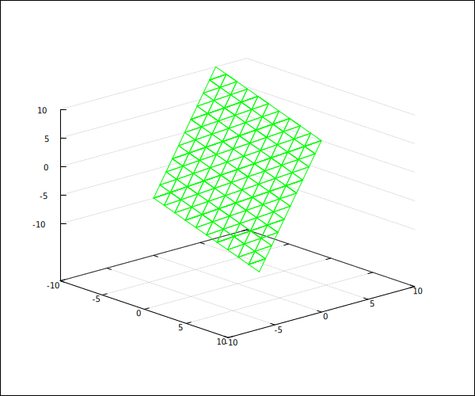

# 9/15 作业

1. $3\times7$ .

2. (1) $\begin{pmatrix}35\\
   6\\
   49\end{pmatrix}$ .
   
   (2) $\mathbf 0_{2\times2}$ .
   
   (3) $10$ .
   
   (4) $\begin{pmatrix}\mathop{-}2 & 4\\
   \mathop{-}1 & 2\\
   \mathop{-}3 & 6\end{pmatrix}$ .
   
   (5) $\begin{pmatrix}6 & \mathop{-}7 & 8\\
   20 & \mathop{-}5 & \mathop{-}6\end{pmatrix}$ .
   
   (6) $\begin{pmatrix}1 & 2 & 5 & 2\\
   0 & 1 & 2 & \mathop{-}4\\
   0 & 0 & \mathop{-}4 & 3\\
   0 & 0 & 0 & \mathop{-}9\end{pmatrix}$ .
   
   (7) $h$ .

3. (1) $A=\left( \begin{matrix} -\frac{1}{2} & -\frac{\sqrt 3}{2} \\ \frac{\sqrt 3}{2} & -\frac{1}{2} \end{matrix} \right)=\left( \begin{matrix} \cos\theta & -\sin\theta \\ \sin\theta & \cos\theta \end{matrix} \right)$ , where $\theta=\frac{2\pi}{3}$ .
   
   $A$ is rotation matrix by $\frac{2\pi}{3}$ . $A^{2025}$ is rotation by $\frac{2\pi}{3} \cdot 2005 = \frac{4010\pi}{3} \cong \frac{2\pi}{3}$ .
   
   $A^{2025}=A=\left( \begin{matrix} -\frac{1}{2} & -\frac{\sqrt 3}{2} \\ \frac{\sqrt 3}{2} & -\frac{1}{2} \end{matrix} \right)$ .
   
   (2) $\begin{pmatrix}1 & na\\
   0 & 1\end{pmatrix}$ .

4. $\left\{ 5 \right\}$ .

5. (1) $\left\{ \begin{pmatrix}x & y\\
   y & x\end{pmatrix} \middle| x,y \in \R \right\}$ .
   
   (2) All $3\times3$ diagonals.

6. (1) $\left\{ \begin{pmatrix}a & b\\
   -2a-2 & 1-2 b\\
   \frac{3 a+5}{3} & \frac{3 b-2}{3}\end{pmatrix} \middle| a,b \in \R \right\}$ .
   
   (2) $\begin{pmatrix}1 & 0.1\\
   0 & 1\end{pmatrix}$ .

7. $\left\{ (x,y,z) \in \R^3 | z=x+3y \right\}$ .
   
   Plot.
   
   

8. $\left\{ (w,-6w,9w,-4w) | w\in \R \right\}$ .

9. $\left\{ (2,3,-4) \right\}$ .
