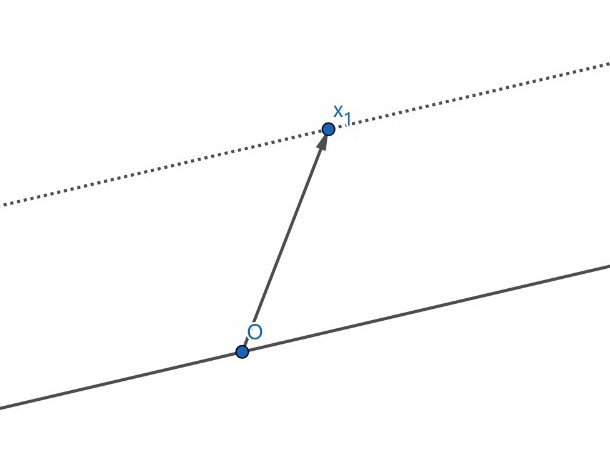

# 9/22 作业

Homework 4

1. (1) $3$ , $1$ , $2$ .

   (2) $2$ , $2$ , 相同。

   (3) $3$ .

2. $\mathbf 1_4$ , $\begin{pmatrix}1 & 0 & 0\\
   0 & 1 & 0\\
   0 & 0 & 1\\
   0 & 0 & 0\\
   0 & 0 & 0\end{pmatrix}$ .

3. (a) $\operatorname{diag}( \frac{2}{5}, 0, -\frac{1}{9} )$ .

   (b) $\begin{pmatrix}1 & 1 & \frac{2}{3}\\
   0 & 0 & 0\\
   \frac{1}{2} & \frac{1}{2} & \frac{1}{3}\end{pmatrix}$ .

   (c) $\begin{pmatrix}\frac{8}{5} & 1 & 1\\
   0 & 3 & 1\\
   0 & 0 & -\frac{1}{9} \end{pmatrix}$ .

   (d) $\begin{pmatrix}1 & 1 & \frac{2}{3}\\
   1 & 1 & \frac{8}{9}\\
   1 & 1 & \frac{7}{9}\end{pmatrix}$ .

4. (a) $\mathbf 1_3$ because rank of the coefficient matrix is $3$ .

   (b) Unique because $A$ is invertible.

   (c) $0$ or $1$ .

   $\operatorname{rank}(A) = \operatorname{rank}(A | \vec b)=3$ since $A \vec x = \vec b$ has unique solution.

   $\operatorname{rank}(A | \vec c) = 3$ or $4$ , then $\operatorname{rank}(A) \le \operatorname{rank}(A | \vec c)$ , and the system has either one or no solution.

5. (a) Infinitely many.

   Because $\operatorname{rank}(A)=n$ , $A$ has right inverse.

   Therefore $AA^+ = \mathbf 1_n$ .

   **Lemma 1** $\forall X : \R^{m \times n}$ , $A (A^+ + (\mathbf 1_m - A^+A)X) = \mathbf 1_n$ .

   **Proof**

   $$
   \begin{align*}
   A (A^+ + (\mathbf 1_m - A^+ A) X) \\
   & = A A^+ + A (\mathbf 1_m - A^+ A) X \\
   & = \mathbf 1_n + (A - A A^+ A) X \\
   & = \mathbf 1_n + (A - A) X \\
   & = \mathbf 1_n
   \end{align*}
   $$

   $\square$ .

   By lemma 1, obviously there are infinitely many right inverse of $A$ .

   (b) Only $A^{-1}$ .

## Optional

1. a. $\vec x = \mathbf 0$ is a solution.

   b. $\operatorname{rank}(A) = \operatorname{rank}(A|\vec 0) \lt \text{number of variables}$ .

   c. $A (\vec x_1 + \vec x_2) = A \vec x_1 + A \vec x_2 = \vec 0$ .

   d. $A(k \vec x) = k(A \vec x) = \vec 0$ .

2. a. $A (\vec x_1 + \vec x_h) = A \vec x_1 + A \vec x_h = \vec b + \vec 0 = \vec  b$ .

   b. $A (\vec x_2 - \vec x_1) = A \vec x_2 - A \vec x_1 = \vec b - \vec b = \vec 0 $ .

   c. Plot.

   
